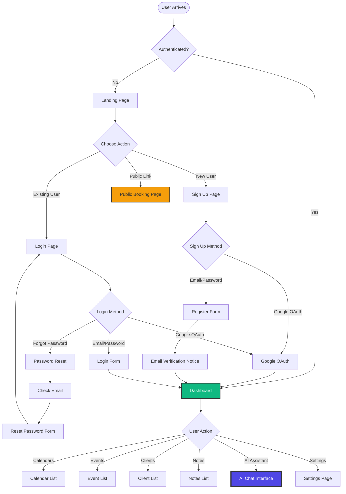
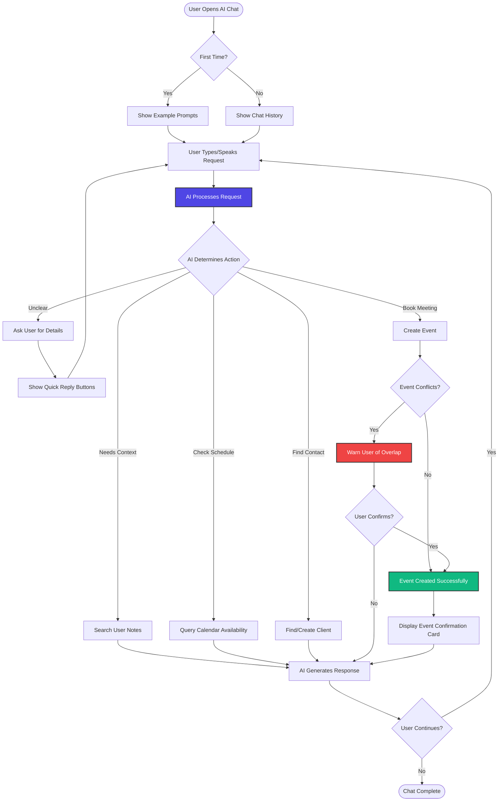
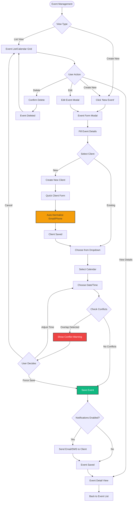
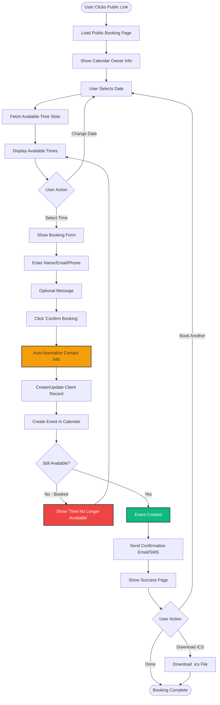
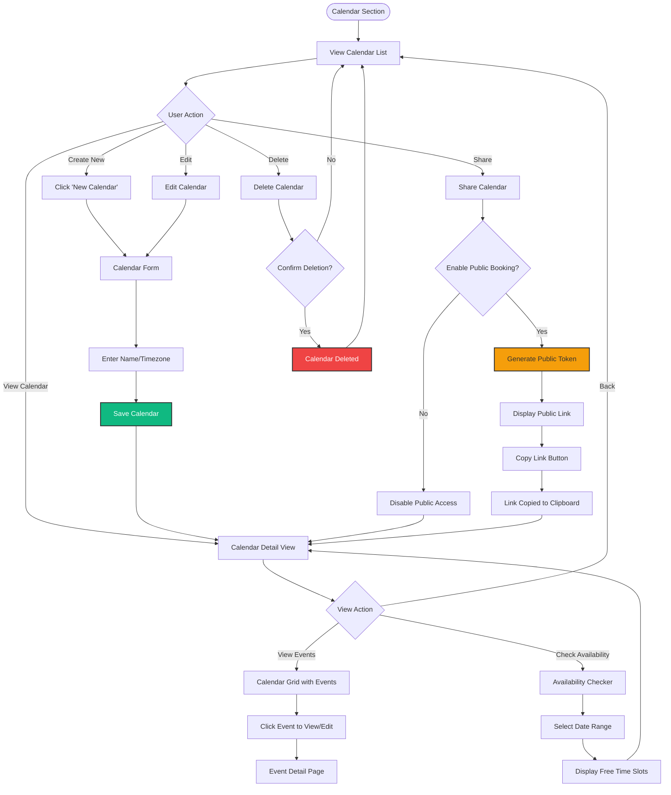
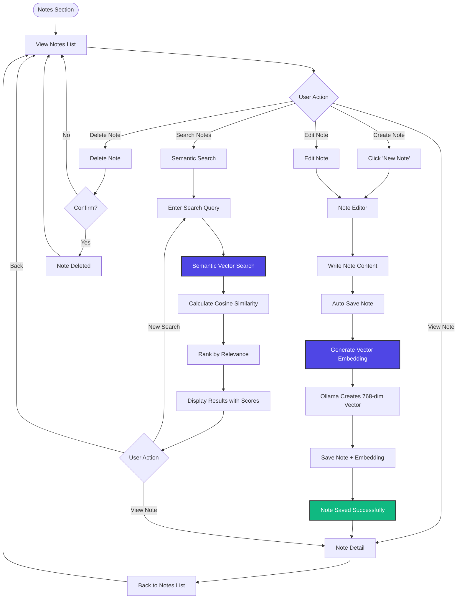
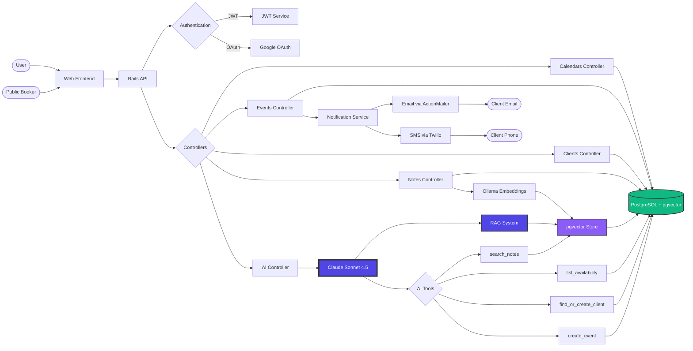

# Callab User Flow Diagrams

## Main User Flows

## AI Assistant Flow (Core Feature)

## Event Management Flow

## Public Calendar Booking Flow (No Auth)

## Calendar Management Flow

## Notes & Preferences Flow

## Complete System Architecture Flow

---

## How to View These Diagrams

1. **In GitHub**: These will render automatically if you push this file to GitHub
2. **In VS Code**: Install the "Markdown Preview Mermaid Support" extension
3. **Online**: Copy and paste into [Mermaid Live Editor](https://mermaid.live)
4. **In Figma**: Use the "Mermaid Chart" plugin to import these diagrams

## Diagram Descriptions

- **Main User Flows**: Overall navigation and authentication paths
- **AI Assistant Flow**: Detailed interaction with the Claude AI assistant
- **Event Management Flow**: Creating, editing, and managing events
- **Public Calendar Booking Flow**: External user booking without authentication
- **Calendar Management Flow**: Managing multiple calendars and sharing
- **Notes & Preferences Flow**: Creating notes with semantic search
- **System Architecture Flow**: Technical overview of system components

